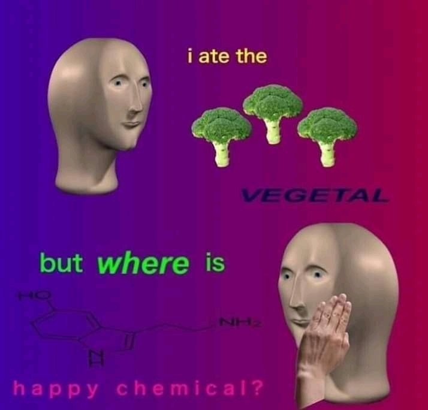

Grabbing Veganism by the Bulbs!

-- photograph by Ellis Kay

---

This repository is under construction. The intention is that is offers a description of veganism and the motivations for it, then it describes how it can be done safely, then it lists some vegan-compatible restaurants and markets, *and then* it outlines recipies for some **very fine cuisine**.

---

|**Contents**                                                                                                                                         |**Comments**                                                                                         |
|-----------------------------------------------------------------------------------------------------------------------------------------------------|-----------------------------------------------------------------------------------------------------|
|[Motivations](documentation/why.md)                                                                                                                  |why?                                                                                                 |
|[PETA Vegan Starter Kit](documentation/PETA-UK-VSK.pdf)                                                                                              |how?                                                                                                 |
|[Gallery](media/gallery.md)                                                                                                                          |what?                                                                                                |
|[How to be a human vegan](documentation/how.md)                                                                                                      |how?                                                                                                 |
|[*Free* and *cheap* food in Glasgow](restaurants_and_markets/Glasgow/free_and_cheap_food/documentation/2012-08-15_free_and_cheap_food_in_Glasgow.pdf)|                                                                                                     |
|[*How India Cooks Lunch for 50,000 People for FREE! The MIRACLE in Punjab, India.*](https://www.youtube.com/watch?v=qdoJroKUwu0)                     |A documentary on the continuous food output produced by The Golden Temple/Darbar Sahib of Amritsar.  |
|[Restaurants and markets](restaurants_and_markets)                                                                                                   |                                                                                                     |
|[Recipes](recipes)                                                                                                                                   |                                                                                                     |
|[Cheese](documentation/cheese.md)                                                                                                                    |cheese alteriatives etc.                                                                             |
|[Legal](documentation/legal.md)                                                                                                                      |laws, vegan rights etc.                                                                              |
|[Multivariate analysis techniques in veganism](mva.md)                                                                                               |                                                                                                     |

---

As a wise -- indeed, woke -- person once said in the early days of internet,

