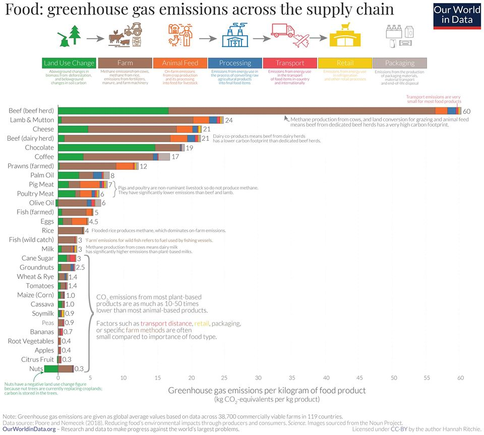

# Motivations/Why?

# tl;dr:

- help save ecosystems (becoming vegan is probably the most significant you can do with your life)
- help reduce suffering
    - help reduce incarceration without verified consent
    - help reduce killing without verified consent
    - help reduce impregnation (rape, de facto without consent)
- be healthier
    - [*Bad diets killing more people globally than tobacco, study finds*](https://www.theguardian.com/society/2019/apr/03/bad-diets-killing-more-people-globally-than-tobacco-study-finds) (2019-04-03)
        - [*Health effects of dietary risks in 195 countries, 1990–2017: a systematic analysis for the Global Burden of Disease Study 2017*](https://www.thelancet.com/action/showPdf?pii=S0140-6736%2819%2930041-8) (2017)
- have fun cooking and tasting

[According to UN research](http://www.fao.org/3/a-i3437e.pdf), the animal industry accounts for ~14.5 % of *all* human-made greenhouse gas emissions. Note that this is slighly more than **all** of the global exhaust exissions of trains, planes and automobiles, and ships, [according to the Royal Institute of International Fairs (Chatham House)](https://www.chathamhouse.org/sites/default/files/publications/research/CHHJ3820%20Diet%20and%20climate%20change%2018.11.15_WEB_NEW.pdf) (see page 55), who themselves report those numbers from research of the UN and the Intergovernmental Panel on Climate Change (IGPCC). The Chatham House further reports (via two references) that humans who don't take animal products produce about **half** or the greenhouse gases of those who do [[ref](https://www.pnas.org/content/pnas/early/2016/03/16/1523119113.full.pdf)].

- [Eating Vegan is the Most Effective Way to Combat Climate Change, Says Largest-Ever Food Production Analysis](https://www.livekindly.co/eating-vegan-is-the-most-effective-way-to-combat-climate-change-says-largest-ever-food-production-analysis) -- Nadia Murray-Ragg (2018-06-01)
    - reference: [*Reducing food’s environmental impacts through producers and consumers*](http://science.sciencemag.org/content/360/6392/987) (2018-06-01)
- [(infographic on Reddit) *Animal-based diet versus plant-based Diet: Land Use*](https://old.reddit.com/r/vegan/comments/7y82do/the_land_we_could_save_by_not_consuming_animals)

Put in other words: If you want to SAVE LIVES (like 8 fucking million human apes over the next 30 years) then:

**The Most Significant, Impactful thing, a thing that you can do with you live is plausiblly to become vegan.**

- [*Lifetime experience with (classic) psychedelics predicts pro-environmental behavior through an increase in nature relatedness* -- Matthias Forstmann, Christina Sagioglou, Journal of Psychopharmacology (2017-06-20)](https://journals.sagepub.com/doi/10.1177/0269881117714049)
